# Universo de Marca® — Grupo Linhares

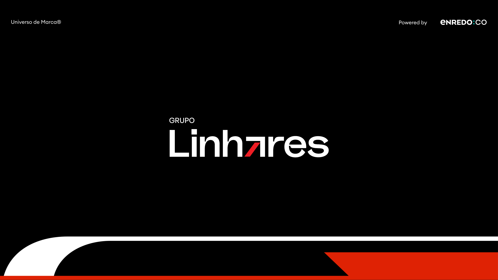

> Versão em Markdown do brandbook **Universo de Marca® (parceiros) — Grupo Linhares** (_Powered by_ enredo.co).
> Este documento é o guia de referência da identidade visual da marca **a ser aplicada na plataforma**.
> Use-o para garantir uma comunicação consistente e impactante, sempre alinhada às orientações aqui apresentadas.

Idioma do conteúdo: pt-BR. Cores, medidas e specs são transcritas fielmente do material original. As imagens de referência estão em [`./assets/brandbook/`](./assets/brandbook/).

---

## Sumário

- [1. Estratégia de Marca](#1-estratégia-de-marca)
  - [Posicionamento](#posicionamento)
  - [Propósito](#propósito)
- [2. Identidade de Marca](#2-identidade-de-marca)
  - [Assinatura Visual](#assinatura-visual)
  - [Área de Segurança](#área-de-segurança)
  - [Redução Mínima](#redução-mínima)
  - [Aplicações do Logotipo](#aplicações-do-logotipo)
  - [Usos Incorretos](#usos-incorretos)
  - [Paleta Cromática](#paleta-cromática)
  - [Combinações de Cores](#combinações-de-cores)
  - [Tipografia](#tipografia)
  - [Hierarquia Tipográfica](#hierarquia-tipográfica)
  - [Grafismos](#grafismos)
  - [Iconografia Funcional](#iconografia-funcional)
- [3. In Use](#3-in-use)
  - [Papelaria Institucional](#papelaria-institucional)
- [4. Aplicação na plataforma (mapeamento de tokens)](#4-aplicação-na-plataforma-mapeamento-de-tokens)

> **Nota de cobertura.** O PDF de origem traz os capítulos de **Estratégia** e **Identidade** e o início de **In Use**. Os itens do índice do brandbook que **não constam neste arquivo** estão sinalizados ao longo do documento.

---

## 1. Estratégia de Marca

Alicerce estratégico sobre o qual a marca é construída. Ela abrange o posicionamento, a personalidade da marca e o propósito de marca, servindo como guia para todas as interações e comunicações. A estratégia de marca é essencial para garantir a consistência e a autenticidade da marca em todos os pontos de contato com o público.

Tópicos da seção: **Posicionamento**, **Propósito**, _Personalidade_, _Arquétipos_, _Identidade Verbal_, _Tom de Voz_, _Manifesto_.

> _Personalidade, Arquétipos, Identidade Verbal, Tom de Voz e Manifesto_ constam no índice do brandbook, mas não estão presentes neste PDF.

### Posicionamento

> Para colaboradores, comunidades e parceiros do setor automotivo, o Grupo Linhares é o grupo empresarial que **impulsiona conquistas, gerando prosperidade coletiva e transformação regional** através de **+25 anos** de relacionamentos sólidos no Nordeste brasileiro.

### Propósito

Um propósito consolidado e vivido como um "mantra" dentro da empresa:

> **Contribuir com as conquistas das pessoas, gerando juntos prosperidade e alegria por toda vida.**

---

## 2. Identidade de Marca

O conjunto de elementos visuais que compõem nossa identidade visual. Isso inclui o logotipo, a paleta de cores, a tipografia, os padrões gráficos e outros elementos de design utilizados de maneira consistente para criar uma imagem coesa da marca. O sistema gráfico é crucial para a identificação visual imediata da marca pelo público e para a diferenciação no mercado.

### Assinatura Visual

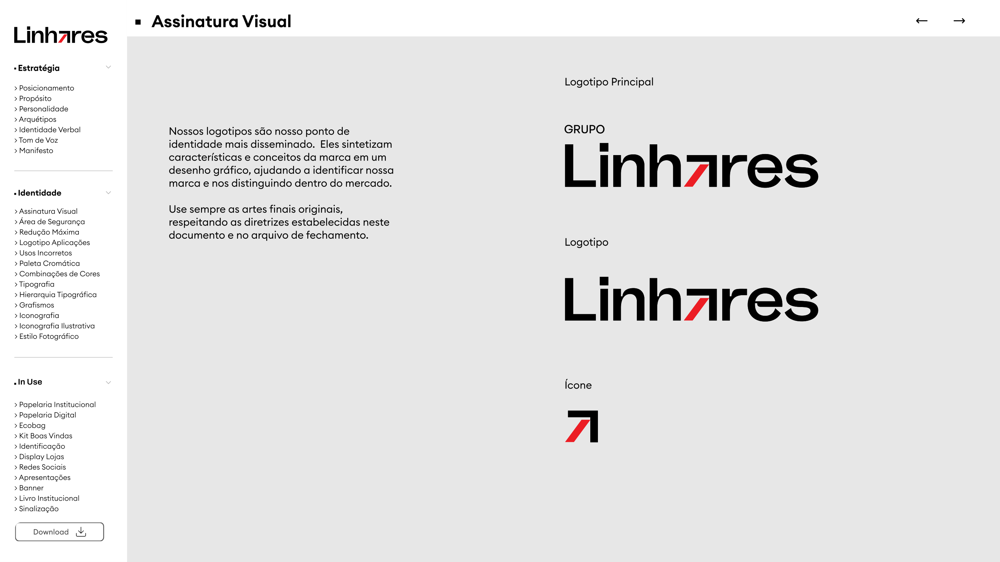

Nossos logotipos são nosso ponto de identidade mais disseminado. Eles sintetizam características e conceitos da marca em um desenho gráfico, ajudando a identificar nossa marca e a distingui-la no mercado. **Use sempre as artes finais originais**, respeitando as diretrizes deste documento e do arquivo de fechamento.

Variações da assinatura:

- **Logotipo Principal** — lockup "GRUPO Linhares".
- **Logotipo** — "Linhares".
- **Ícone** — símbolo da seta (vermelho/preto).

### Área de Segurança

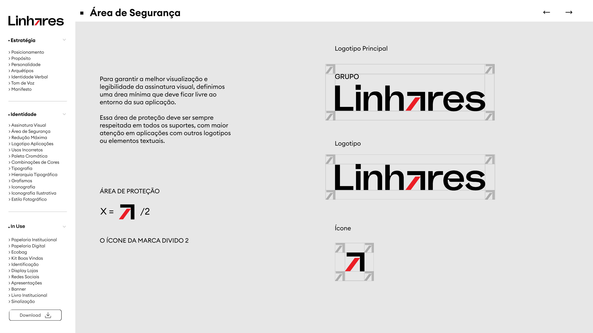

Para garantir a melhor visualização e legibilidade da assinatura visual, definimos uma área mínima que deve ficar livre ao redor da sua aplicação. Essa área de proteção deve ser sempre respeitada em todos os suportes, com maior atenção em aplicações com outros logotipos ou elementos textuais.

**Área de proteção:** `X = ícone ÷ 2` — ou seja, a margem mínima equivale ao ícone da marca dividido por 2.

### Redução Mínima

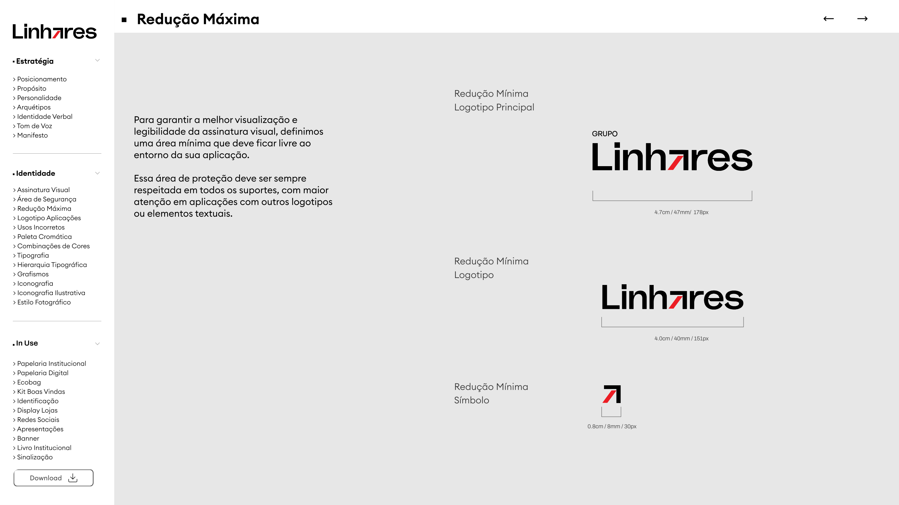

Tamanhos mínimos para preservar a legibilidade da assinatura:

| Versão | cm | mm | px |
|---|---|---|---|
| Logotipo Principal ("GRUPO Linhares") | 4,7 cm | 47 mm | 178 px |
| Logotipo ("Linhares") | 4,0 cm | 40 mm | 151 px |
| Símbolo (ícone) | 0,8 cm | 8 mm | 30 px |

### Aplicações do Logotipo

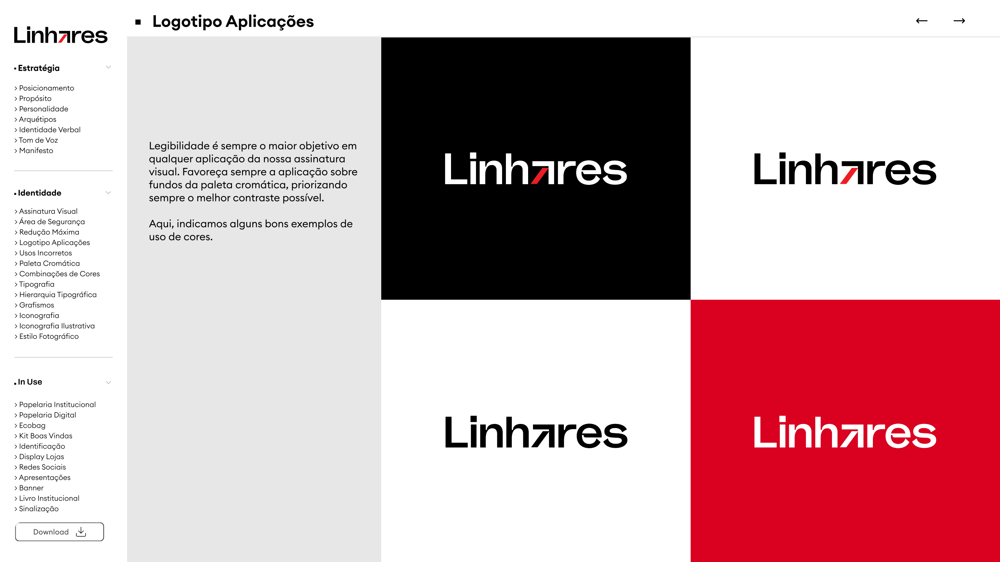

Legibilidade é sempre o maior objetivo em qualquer aplicação da assinatura visual. Favoreça sempre a aplicação sobre fundos da paleta cromática, priorizando o **melhor contraste possível**. Bons exemplos de uso de cor: assinatura sobre fundo **preto**, **branco** e **vermelho** institucional.

### Usos Incorretos

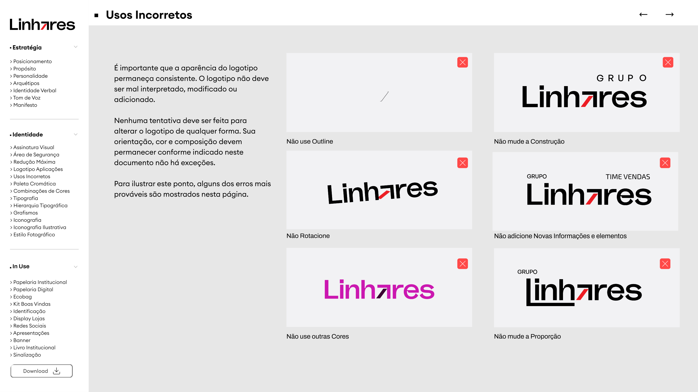

A aparência do logotipo deve permanecer consistente. Ele não deve ser mal interpretado, modificado ou ter elementos adicionados. Sua orientação, cor e composição devem permanecer conforme indicado neste documento — **não há exceções**. Erros mais prováveis a evitar:

- ❌ Não use em **outline**.
- ❌ Não mude a **construção**.
- ❌ Não **rotacione**.
- ❌ Não adicione **novas informações e elementos**.
- ❌ Não use **outras cores**.
- ❌ Não mude a **proporção**.

### Paleta Cromática

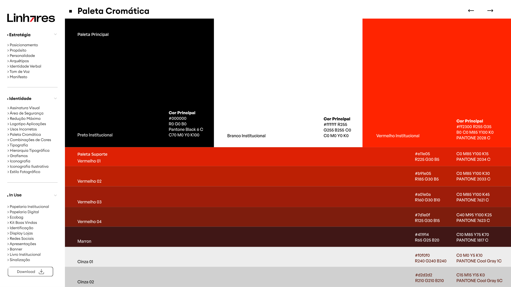

#### Paleta Principal

| Cor | HEX | RGB | CMYK | Pantone |
|---|---|---|---|---|
| Preto Institucional | `#000000` | R0 G0 B0 | C70 M0 Y0 K100 | Black 6 C |
| Branco Institucional | `#ffffff` | R255 G255 B255 | C0 M0 Y0 K0 | — |
| Vermelho Institucional | `#ff2300` | R255 G35 B0 | C0 M85 Y100 K0 | 2028 C |

#### Paleta de Suporte

| Cor | HEX | RGB | CMYK | Pantone |
|---|---|---|---|---|
| Vermelho 01 | `#e11e05` | R225 G30 B5 | C0 M85 Y100 K15 | 2034 C |
| Vermelho 02 | `#b91e05` | R185 G30 B5 | C0 M85 Y100 K30 | 2033 C |
| Vermelho 03 | `#a01e0a` | R160 G30 B10 | C0 M85 Y100 K45 | 7621 C |
| Vermelho 04 | `#7d1e0f` | R125 G30 B15 | C40 M95 Y100 K25 | 7623 C |
| Marrom | `#411914` | R65 G25 B20 | C10 M85 Y75 K70 | 1817 C |
| Cinza 01 | `#f0f0f0` | R240 G240 B240 | C0 M0 Y5 K10 | Cool Gray 1C |
| Cinza 02 | `#d2d2d2` | R210 G210 B210 | C15 M15 Y15 K0 | Cool Gray 5C |

### Combinações de Cores

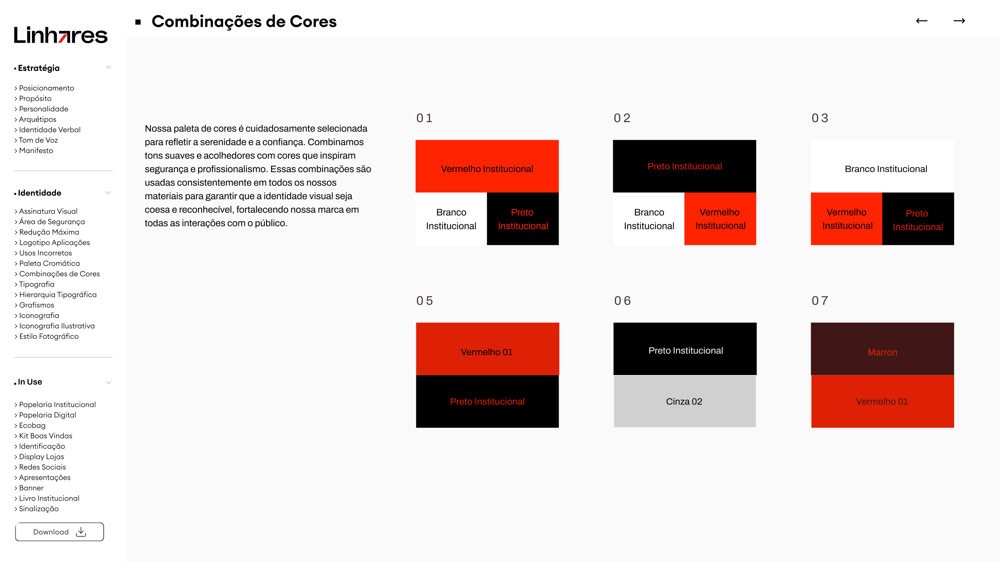

Nossa paleta é cuidadosamente selecionada e combinada para garantir que a identidade visual seja usada de forma consistente e reconhecível, fortalecendo a marca em todas as interações com o público. Combinações recomendadas:

| # | Combinação |
|---|---|
| 01 | Vermelho Institucional + (Branco Institucional / Preto Institucional) |
| 02 | Preto Institucional + (Branco Institucional / Vermelho Institucional) |
| 03 | Branco Institucional + (Vermelho Institucional / Preto Institucional) |
| 05 | Vermelho 01 + Preto Institucional |
| 06 | Preto Institucional + Cinza 02 |
| 07 | Marrom + Vermelho 01 |

Exemplos de aplicação da paleta em peças, iniciativas, momentos e campanhas:

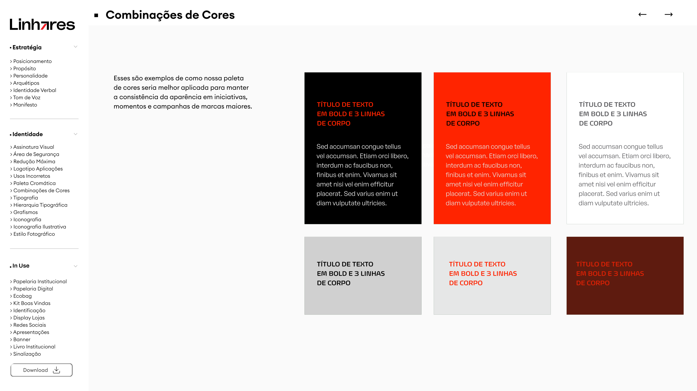

### Tipografia

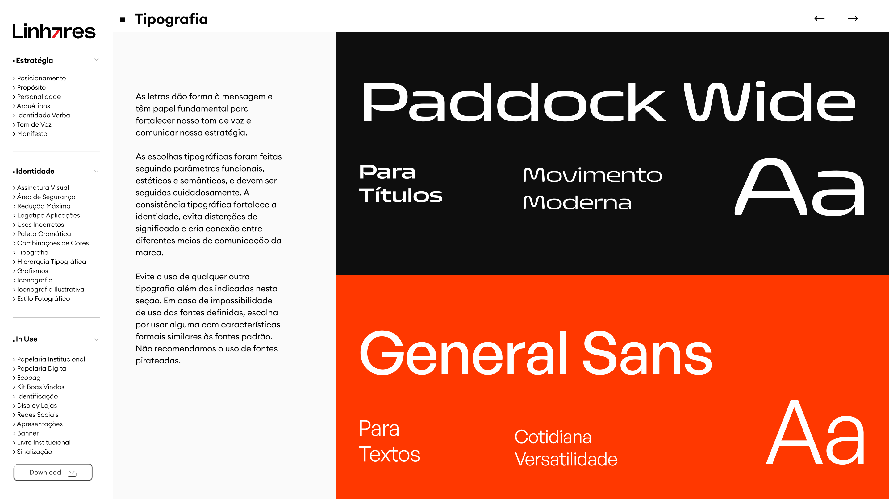

As letras dão forma à mensagem e têm papel fundamental para fortalecer o tom de voz e comunicar a essência da marca. As escolhas tipográficas foram feitas seguindo parâmetros funcionais, estéticos e semânticos, e devem ser seguidas cuidadosamente. A consistência tipográfica fortalece a identidade, evita distorções de significado e cria conexão entre os meios de comunicação da marca.

| Fonte | Uso | Caráter |
|---|---|---|
| **Paddock Wide** | Para Títulos | Movimento, Moderna |
| **General Sans** | Para Textos | Cotidiana, Versátil |

Evite o uso de qualquer outra tipografia além das indicadas. Em caso de impossibilidade de uso das fontes definidas, opte por uma com características formais similares às fontes padrão. **Não é recomendado o uso de fontes pirateadas.**

### Hierarquia Tipográfica

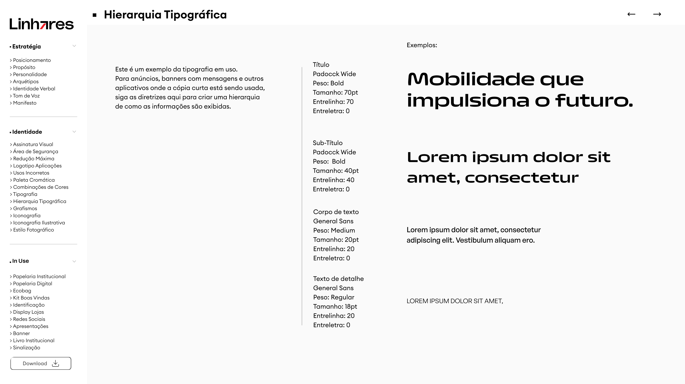

Para anúncios, banners e textos curtos, siga estas diretrizes para criar a hierarquia de como as informações são exibidas:

| Nível | Fonte | Peso | Tamanho | Entrelinha | Entreletra |
|---|---|---|---|---|---|
| Título | Paddock Wide | Bold | 70 pt | 70 | 0 |
| Subtítulo | Paddock Wide | Bold | 40 pt | 40 | 0 |
| Corpo de texto | General Sans | Medium | 20 pt | 20 | 0 |
| Texto de detalhe | General Sans | Regular | 18 pt | 18 | 0 |

### Grafismos

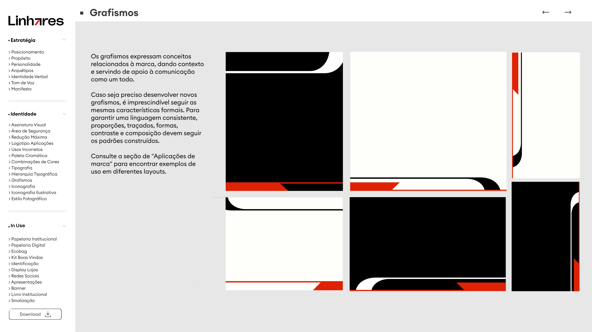

Os grafismos expressam conceitos relacionados à marca, dando contexto e servindo de apoio à comunicação como um todo. Caso seja preciso desenvolver novos grafismos, é imprescindível seguir as mesmas características formais. Para garantir uma linguagem consistente, **proporções, traçados, formas, contraste e composição** devem seguir os padrões construídos.

### Iconografia Funcional

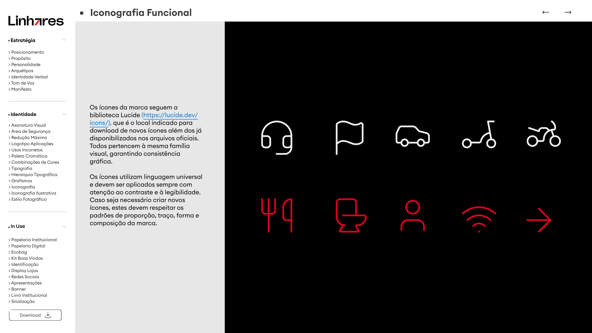

Os ícones da marca seguem a biblioteca **[Lucide](https://lucide.dev/icons/)**, que é o local indicado para download de novos ícones além dos já disponibilizados nos arquivos oficiais. Todos pertencem à mesma família visual, garantindo consistência gráfica.

Os ícones utilizam linguagem universal e devem ser aplicados sempre com atenção ao **contraste** e à **legibilidade**. Caso seja necessário criar novos ícones, eles devem respeitar os padrões de **proporção, traço, forma e composição** da marca.

---

## 3. In Use

### Papelaria Institucional

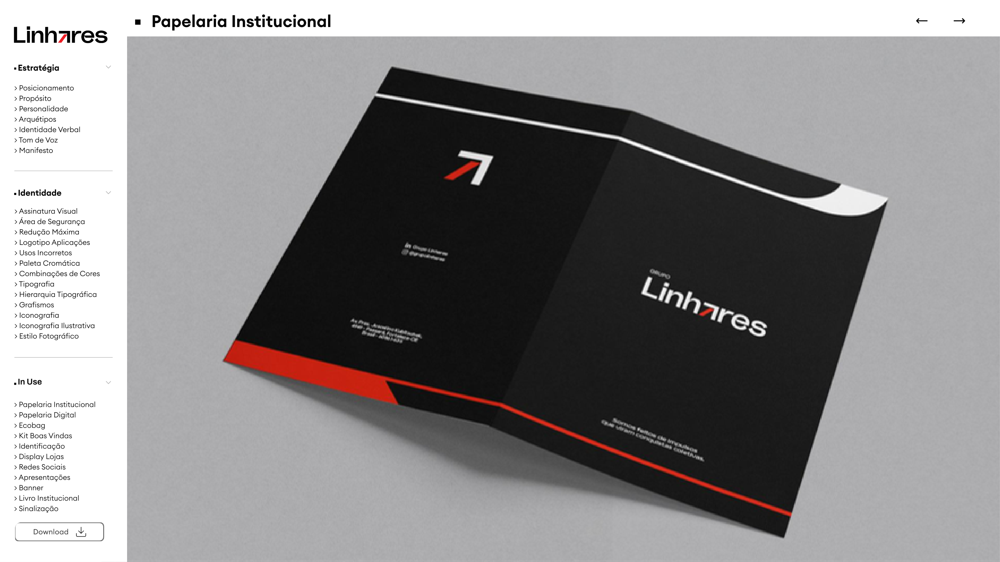

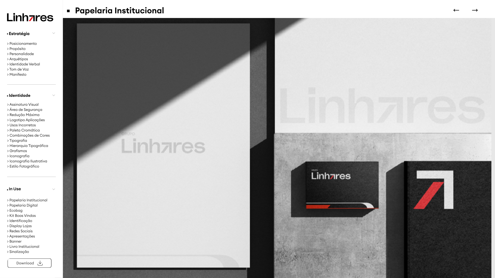

Aplicações em papel timbrado, pasta, envelopes e sinalização/placas, sempre sobre a paleta institucional e respeitando área de segurança e contraste.

Dados de contato presentes no material:

- **Endereço:** Av. Pres. Juscelino Kubitschek, 4949 — Passaré, Fortaleza-CE, 60861-635
- **Social:** `@grupolinhares`

> Os demais itens de "In Use" do índice do brandbook — _Papelaria Digital, Ecobag, Kit Boas-Vindas, Identificação, Display Lojas, Redes Sociais, Apresentações, Banner, Livro Institucional e Sinalização_ — não constam neste PDF.

---

## 4. Aplicação na plataforma (mapeamento de tokens)

> **Sugestão de tradução** da marca para o design system da plataforma (`packages/ui/src/styles/globals.css`, Tailwind v4 via `@theme inline`). Esta seção **documenta** o caminho de aplicação; nenhum token de UI é alterado por este documento.
>
> Hoje a plataforma usa uma base **azul** (`--primary` ≈ `#1260A8`). A marca Grupo Linhares é **preto/branco/vermelho `#ff2300`** — portanto o reskin abaixo é um trabalho de design a ser executado em tarefa própria.

### Paleta da marca em OKLCH

O design system usa cores em `oklch`. Conversões a partir do HEX da marca:

| Marca | HEX | OKLCH |
|---|---|---|
| Vermelho Institucional | `#ff2300` | `oklch(0.637 0.249 30.9)` |
| Vermelho 01 | `#e11e05` | `oklch(0.580 0.226 30.6)` |
| Vermelho 02 | `#b91e05` | `oklch(0.505 0.191 31.4)` |
| Vermelho 03 | `#a01e0a` | `oklch(0.458 0.168 31.5)` |
| Vermelho 04 | `#7d1e0f` | `oklch(0.391 0.132 31.8)` |
| Marrom | `#411914` | `oklch(0.273 0.064 29.1)` |
| Cinza 01 | `#f0f0f0` | `oklch(0.955 0 0)` |
| Cinza 02 | `#d2d2d2` | `oklch(0.864 0 0)` |
| Preto | `#000000` | `oklch(0 0 0)` |
| Branco | `#ffffff` | `oklch(1 0 0)` |

### Mapeamento sugerido de variáveis

| Variável CSS | Valor sugerido | Origem na marca |
|---|---|---|
| `--primary` | `oklch(0.637 0.249 30.9)` | Vermelho Institucional |
| `--primary-foreground` | `oklch(1 0 0)` | Branco |
| `--ring` | `oklch(0.637 0.249 30.9)` | Vermelho Institucional |
| `--foreground` | `oklch(0 0 0)` | Preto |
| `--background` | `oklch(1 0 0)` | Branco |
| `--muted` | `oklch(0.955 0 0)` | Cinza 01 |
| `--secondary` / `--border` / `--input` | `oklch(0.864 0 0)` | Cinza 02 |
| `--sidebar` | `oklch(0 0 0)` (foreground branco) | Preto (superfícies escuras da marca) |
| `--chart-1` … `--chart-5` | rampa: `#ff2300` → Vermelho 01..04 → Marrom | Paleta principal + suporte |
| `--destructive` | manter vermelho **distinto** do primário (ex.: Vermelho 03 / Marrom) ou revisar UX | — |

> **Atenção:** como o vermelho é a cor de marca **e** o tom usual de erro, defina `--destructive` para não conflitar com `--primary` (alternativas: Vermelho 03, Marrom, ou um vermelho mais escuro reservado a estados de erro).

### Tipografia

- Marca: **Paddock Wide** (display/títulos) + **General Sans** (texto).
- Plataforma hoje: Nunito Sans (`--font-display`), Pontano Sans (`--font-body`), Taviraj (`--font-serif`).
- **General Sans** é gratuita (Fontshare). **Paddock Wide é comercial — verificar licença** antes de embutir.
- Caminho de adoção: importar via `next/font/local` em `apps/webapp/app/layout.tsx` e mapear para `--font-display` / `--font-body`.

### Ícones

- A plataforma já usa **`lucide-react`**, exatamente a biblioteca indicada pela marca — **100% alinhado**, sem mudança necessária.

### Grafismos

- As formas diagonais/seta derivadas do ícone podem virar **acentos decorativos** de seções e _heros_, respeitando proporção, traçado e contraste.

### Raio / forma

- A marca tem estética mais angular; o token `--radius` atual é `0.75rem`. A decisão sobre reduzir o raio (visual mais reto) fica para o time de design.
